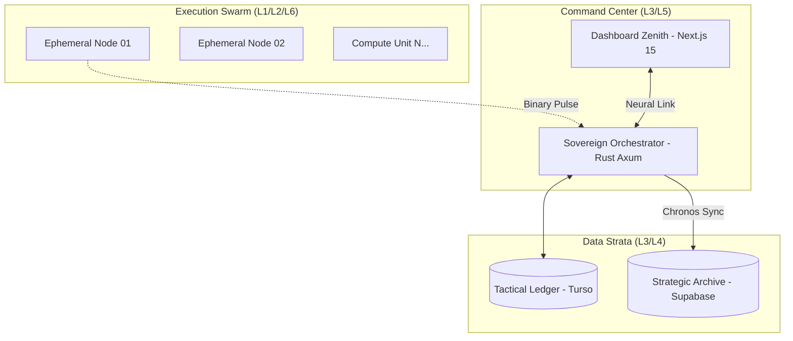

# 💠 PROSPECTOR BTC // SYNC-ZENITH EDITION
### Distributed Cryptographic Audit Suite & Entropy Archaeology System


---

## 🌌 Visión Ejecutiva
**Prospector BTC** es una infraestructura de computación distribuida de alto rendimiento diseñada para la auditoría masiva de la curva elíptica **secp256k1**. Mediante la orquestación de nodos efímeros en la nube, el sistema ejecuta una inspección forense sobre el set UTXO de Bitcoin, identificando vulnerabilidades derivadas de implementaciones de entropía defectuosas y fallos históricos en generadores de números pseudoaleatorios (PRNG).

---

## 🚀 Capacidades de Alto Rendimiento

El sistema ha sido nivelado para saturar el silicio moderno mediante optimizaciones matemáticas de bajo nivel:

*   **⚡ SIMD 4-Way Ignition:** Uso de registros vectoriales de 256 bits (AVX2/AVX-512) para procesar 4 claves simultáneamente por ciclo de instrucción.
*   **📐 Aritmética Jacobiana Proyectiva:** Eliminación del cuello de botella del inverso modular, reduciendo el coste de adición de puntos en un factor de 100x.
*   **🔋 Montgomery Batch Inversion:** Procesamiento de ráfagas (Magazines) de 1024 puntos mediante inversión simultánea, maximizando el throughput operativo.
*   **🏗️ Deterministic Sharding:** Filtros de Bloom particionados que permiten consultas O(1) en memoria volátil sin dependencia de almacenamiento persistente lento.

---

## 🛠️ Arquitectura del Ecosistema (Hydra-Zero)

El proyecto utiliza una topología de **Monolito Modular Fractal** gestionado por Nx:



🔐 Protocolos de Seguridad y Gobernanza
🛡️ Bóveda Zero-Knowledge (ZK-Vault)
El sistema implementa una arquitectura donde la privacidad del operador es absoluta. Las credenciales de acceso a los recursos de cómputo son cifradas localmente en el navegador:
Algoritmo: AES-256-GCM.
Derivación: PBKDF2 con 150,000 iteraciones.
Soberanía: El servidor nunca posee las llaves en claro; el descifrado ocurre exclusivamente en la RAM del nodo de ejecución.

♻️ Protocolo Phoenix
Mecanismo de auto-curación que refresca y rota automáticamente el material de identidad en caliente, extendiendo la vida útil de los runners remotos y mitigando detecciones por comportamiento estático.

🔍 Motores de Auditoría Forense
Motor	Objetivo	Tecnología
Satoshi-XP	Arqueología 2009	Simulación de OpenSSL 0.9.8h Stirring
Android LCG	Vulnerabilidad 2013	Reconstrucción de semilla de 48-bits
Sequential	Barrido Global	Aritmética Proyectiva SIMD
Kangaroo	Resolución ECDLP	Algoritmo Pollard's Lambda

📦 Stack Tecnológico
Core Backend & Mining

Rust
- Framework: Axum (Tokyo Runtime)
- Math: Custom secp256k1 (Jacobian / Montgomery / SIMD)
- Database: libSQL (Turso) + PostgreSQL (Supabase)
- Tooling: Nx (Build System)

UI & Control
- Framework: Next.js 15 (App Router)
- State: TanStack Query + Zustand
- Comms: WebSockets Full-Duplex (Binary MessagePack)
- Styles: Tailwind CSS 4.0 (Zenith Design Language)

🚦 Guía de Inicio Rápido (Ops)
1. Preparación del Núcleo

# Instalar dependencias del monorepo
```Bash
pnpm install
```

# Generar diccionarios de internacionalización
```Bash
pnpm i18n:generate
```

# Certificar integridad matemática
```Bash
cargo test --package prospector-core-math
```

2. Despliegue de Infraestructura
El sistema está diseñado para generar binarios MUSL estáticos de 5MB, garantizando portabilidad total:


# Forjar binario estático para nodos remotos
```Bash
pnpm build:miner
```
📖 Wiki & Documentación Técnica
Para una comprensión profunda de la física del algoritmo y los vectores de ataque implementados, visite nuestra Wiki Interna:
Protocolo de Arqueología Satoshi-XP
Manifiesto de Cero Regresiones
Manual de Gobernanza de Identidad
⚖️ Licencia y Ética
Este proyecto es una suite de auditoría académica bajo licencia MIT. Su propósito es la investigación de la resistencia criptográfica de la red Bitcoin. El uso de esta herramienta para el acceso no autorizado a activos de terceros es estrictamente ilegal y contraviene los protocolos éticos del sistema.
Developed by Raz Podesta for MetaShark Tech // 2026
